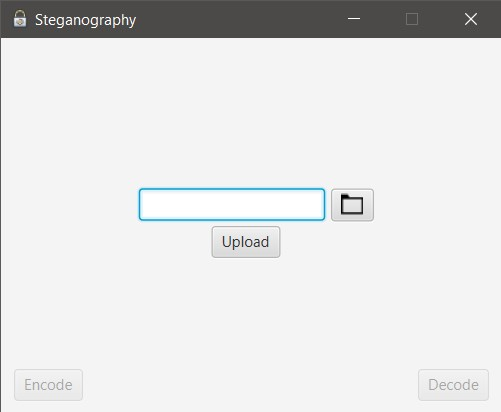
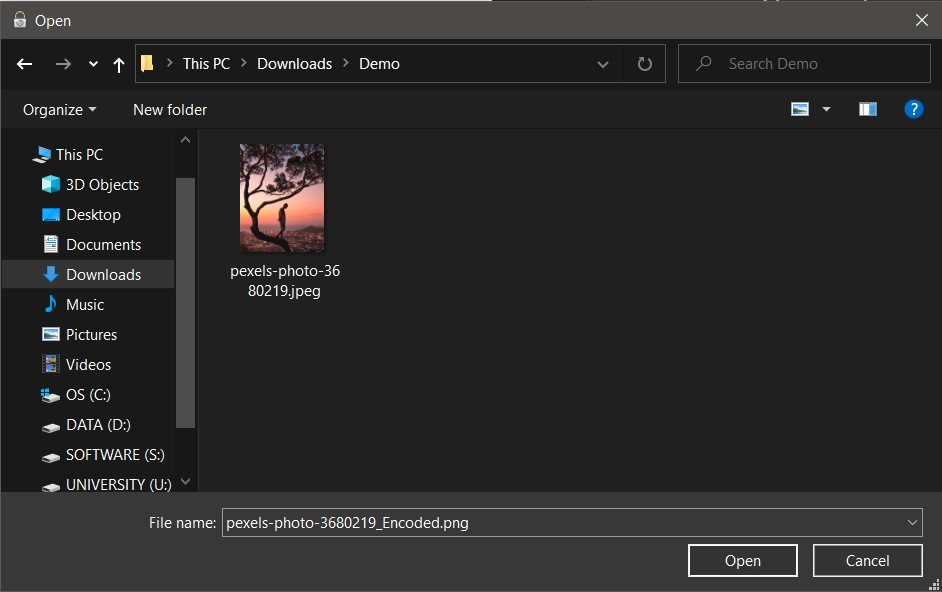
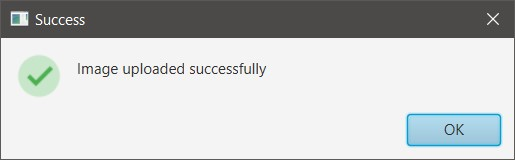
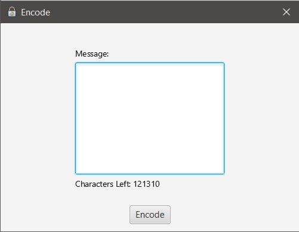
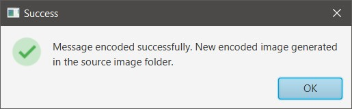
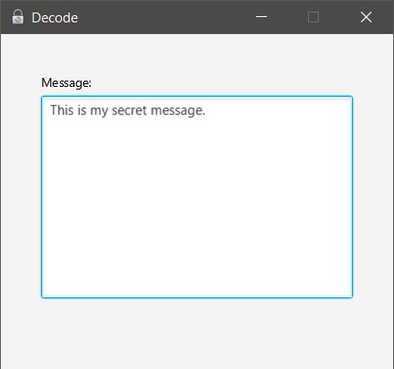

# Steganography

## Synopsis

[Steganography](https://en.wikipedia.org/wiki/Steganography) is the practice of concealing a message within another message or a physical object. In 
computing/electronic contexts, a computer file, message, image, or video is concealed within another file, message,
image, or video.

[LSB-Steganography](https://www.ijltet.org/wp-content/uploads/2015/02/60.pdf) is a steganography technique in which *we
hide messages inside an image* by replacing the *least significant bit* of image with the bits of message to be hidden.
By modifying only the first most right bit of an image we can insert our secret message, and it also makes the picture 
unnoticeable.

In this project, **Image steganography** is implemented using LSB technique.

## Table of Contents

> * [Title](#steganography)
>   * [Synopsis](#synopsis)
>   * [Table of Contents](#table-of-contents)
>   * [Dependencies](#dependencies)
>   * [Installation Guide](#installation-guide)
>   * [Usage](#usage)

## Dependencies

- JavaFX SDK 11.0.2+

## Installation Guide

This project is built using *IntelliJ IDEA 2020.2.3* and *java version 16.0.1*. Hence, the following steps are according
to it. If the reader is using any other IDE, an updated version of IntelliJ IDEA or has java version less than 11, then
he/she has to do the required configuration listed below by themselves.

1. Install [JavaFX SDK](https://www.oracle.com/java/technologies/install-javafx-sdk.html) library
2. Add the JavaFX SDK to the project library. 

   * From the main menu, select **File | Project Structure**.   
   * Open the **Libraries** section, click the **+**, and select **Java**.
   * Specify the path to the **lib** folder in the JavaFX SDK package, for example: **/Users/jetbrains/javafx-sdk-12/lib**.
   * Apply the changes and close the **Project Structure** dialog.
   
3. Add VM Options. _(This step may not be necessary depending upon the IDE and java version)_.
    
   * From the main menu, select **Run | Edit Configurations**.
   * Select **Application | Main** from the list on the left.
   * In the **VM options** field, specify the following options, but make sure to replace `/path/to/javafx/sdk` with 
     the path the **lib** directory of the downloaded JavaFX SDK distribution.
     
     `--module-path /path/to/javafx/sdk --add-modules javafx.controls,javafx.fxml`
     
     If your path contains spaces, wrap it in double quotes, for example: **"/Users/jetbrains/My Folder/javafx-sdk-12/lib"**.

   * Apply the change and close the dialog.

## Usage

A [demo video](Demo.mp4) is uploaded along with the source code to make the working of the project clear. Here are the
steps:

1. [UploadImageView](src/UploadImageView.java) contains the `main` method of the project. Run the project from there.

    

2. Click on the folder icon in the main window. A new file chooser dialog box will open. Find your image and click **Open**.
   
      
   
3. Click on **Upload**. If everything works correctly, you will receive a message saying that 
   *Image uploaded successfully*. Click **OK**.

   
   
4. Click on **Encode**. A new window will open. Type your *secret message* there. 

   

5. Click **Encode**. If everything works correctly, you will receive a message saying that 
   *Message encoded successfully. New encoded image generated in the source image folder*. Click **OK**.
   
   
   
6. Click on the folder icon in the main window. A new file chooser dialog box will open. Browse the source image
   folder. A new image will be generated with the following name *original-name_Encoded.png*. Open and *upload*
   this image.
   
7. Click on **Decode**. A new window will open with the decoded secret message.

   
